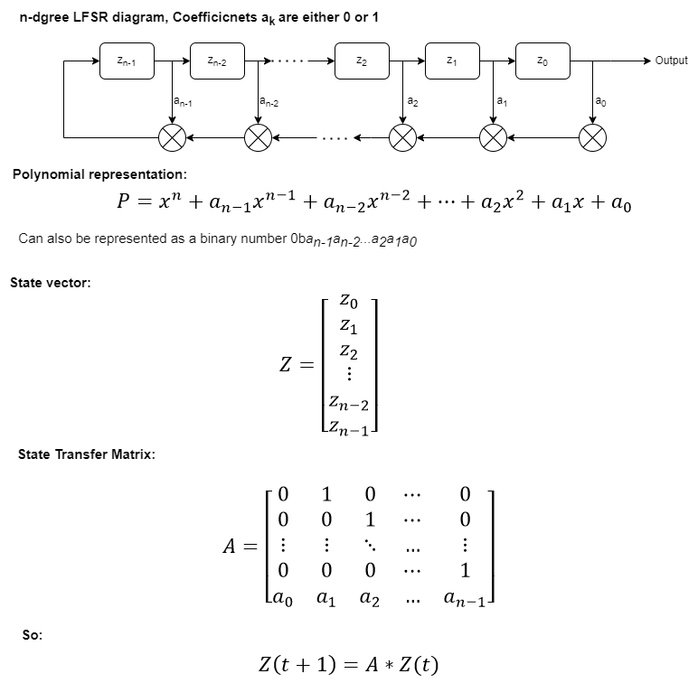

# LFSR
Generic 32-bit LFSR reference implementation

Two implementations are provided and tested against each other:
1. Brute-force implementation, see class BruteforceLfsr32.
2. Matrix style implementation, suitable for parallel computation. See class MatrixLfsr32.

LFSR reference:

